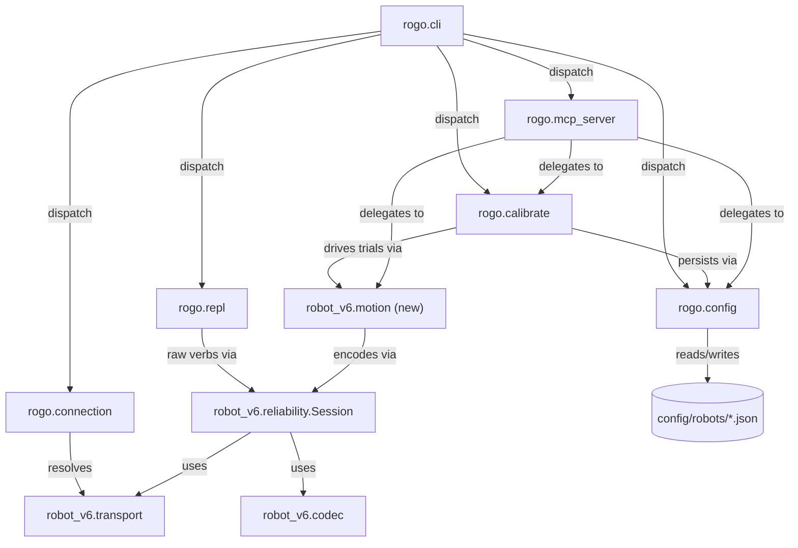

<!-- CLASI: Before changing code or making plans, review the SE process in CLAUDE.md -->

# Sprint 001: Import Rogo CLI onto the v6 host

## Goals

Bring the Rogo CLI's command surface — drive, turn, goto, config, calibrate,
REPL, and MCP server — onto this repo's own v6 host stack (`src/host/robot_v6`,
protocol v6), so classroom users and tooling can drive a robot, a relay, or
`tools/sim` through one CLI without depending on `radio-robot-elite`'s wire
layer. Realizes UC-014 (interactive CLI drive/turn/goto), UC-015 (calibrate),
and UC-016 (MCP server), currently marked "planned" in
`docs/design/usecases.md`.

## Problem

`radio-robot-elite/src/host/robot_radio` (108 Python files) has the CLI
surface classroom users and tooling want, but its transport/wire/protocol
layers predate this repo's v6 protocol work and don't speak protocol v6 or
use `robot_v6`'s `Transport`/`Session`. Vendoring it wholesale would import a
second, divergent wire implementation into a repo whose whole point is one
authoritative protocol-v6 host client.

## Solution

Adapt, don't vendor: keep Rogo's CLI command names and behavior (`rogo drive`,
`turn`, `goto`, `config`, `calibrate`, the REPL, `rogo mcp`) but re-point them
at `robot_v6`'s existing codec/`Transport`/`Session` and protocol v6, dropping
the elite package's own wire codec, serial connection, and server/sim modules
in favor of this repo's equivalents. Higher layers with no wire dependency
(kinematics, nav, path planning, calibration math) are expected to port more
directly than the I/O layer. A prior `rogo-revival` worktree in
`radio-robot-elite/.claude/worktrees/rogo-revival` may hold relevant partial
work worth reviewing during detail planning. Per-robot config
(`robot_config.schema.json`, `active_robot.json`, `devices.json`) is already
staged in this repo's `config/robots/` (see `config/MANIFEST.md`) and does not
need to be re-imported.

## Success Criteria

- `rogo drive`/`turn`/`goto` commands run against a robot, relay, or
  `tools/sim`, all through `robot_v6`'s `Transport`, and report motion outcome
  (ack/nack, completion reason) to the terminal — UC-014.
- `rogo calibrate <robot>` runs a calibration routine over `robot_v6` and
  writes results back to that robot's JSON config in `config/robots/` — UC-015.
- `rogo mcp` starts an MCP server exposing robot motion/config/telemetry as
  MCP tools, translating each call into `robot_v6` traffic — UC-016.
- No code path in the adapted CLI depends on `radio-robot-elite`'s wire codec,
  serial connection, or server/sim modules — all wire traffic goes through
  this repo's `robot_v6` and protocol v6.

## Scope

### In Scope

- The Rogo CLI entry point (`rogo = robot_radio.io.cli:main`) and its
  subcommands: drive, turn, goto, config, calibrate, REPL, `rogo mcp`.
- Re-pointing that CLI surface at `src/host/robot_v6`'s codec, `Transport`,
  and `Session` instead of the elite package's own wire layer.
- Porting the higher-layer subpackages the CLI surface actually depends on
  (e.g. `calibration`, `config`, parts of `kinematics`/`nav`/`path`/
  `pathplan`/`planner`) as needed to support the in-scope commands.
- Reviewing the `rogo-revival` worktree for reusable prior work.

### Out of Scope

- Vendoring or reusing `robot_radio`'s own wire codec, serial connection,
  `server.py`, or sim modules — `robot_v6` and `tools/sim` are this repo's
  equivalents and are not being replaced.
- `testgui` and any other elite subpackage not required by the in-scope CLI
  commands.
- Anything touching firmware (`src/diffdrive/`, `src/protocol/`,
  `src/adapter/`) — this sprint is host-side only.
- Implementing kinematic effect for the motion verbs that currently decode
  but have no planner behind them on `DiffDriveAdapter` (`MOVE_X`, `MOVE_V`,
  `GO_TO_R`, `GO_TO_W`, `WHEELS_X`) — the CLI adapts to whatever the adapter
  currently supports and surfaces the existing `kUnknown` gap rather than
  closing it.
- The WiFi dual-plane transport (`wifi-link.md`) — unimplemented in this
  repo and a separate body of work (UC-012's callout), not a Rogo dependency.

## Test Strategy

Unit tests for the new `robot_v6.motion` convenience layer (unit conversion,
verb encoding) using the existing fake-transport pattern from
`tests/host/robot_v6/`. Unit tests for `rogo.config`'s JSON load/persist
against fixture copies of the staged `config/robots/*.json` files (never the
real files). Integration coverage for `rogo`'s CLI commands (drive, turn,
goto, config, calibrate, repl) runs end to end against `tools/sim` (the
existing no-hardware acceptance path, UC-011), the same way
`tests/host/robot_v6/test_sim_e2e.py` already exercises the reliability
layer — no new hardware-in-the-loop requirement. `rogo mcp`'s tool
definitions get a thin unit test per tool (schema + dispatch to the
underlying motion/config/calibrate call), not a full MCP-protocol
integration test. Each ticket scopes its own test run to the modules it
touches per this repo's standing per-ticket testing rule; the full suite
runs once at `close_sprint`.

## Architecture

**Substantial** — introduces a new host-side CLI subsystem (`rogo`) plus a
new convenience module inside the existing `robot_v6` host client
(`robot_v6.motion`), a new cross-module dependency (`rogo` → `robot_v6`),
and a new external-integration surface (an installable `rogo` console
script). This clears the "3+ modules touched / new cross-module dependency"
bar for the substantial tier, so the full 7-step methodology applies,
including a component diagram.

### Step 1 — Problem

`clasi/issues/import-rogo-cli-adapt-robot-radio-to-v6-host.md` asks for the
Rogo CLI's command surface onto this repo's own v6 host stack. The source,
`radio-robot-elite/src/host/robot_radio` (108 files), is a mature,
protocol-v2/v3-era CLI (`io/cli.py`, 1739 lines) that has accumulated three
generations of wire format (text v1/v2 verbs, a binary COBS+CRC
`pb2.CommandEnvelope` plane, and an aprilcam-camera-daemon closed-loop
layer for `turnto`/`goto`/`--auto` calibration) plus a polymorphic
multi-robot abstraction (`QBotPro`/`Nezha`/`Cutebot`) and hardware this
repo's `DiffDriveAdapter` does not expose (digital/analog ports, gripper,
color/line sensors, OTOS pose). None of that wire/hardware layer transfers;
what transfers is the *command surface* (names, arguments, and — where the
underlying motion is expressible in protocol v6 — behavior) and the
portable math (the rotation/turn model, calibration trial sequencing).

Confirmed by reading `robot_radio/io/cli.py` in full and `config.py`,
`repl.py`, `robot_mcp.py`, `calibrate.py`'s headers: the CLI's `drive`/
`turn` commands already reduce to a timed wheel-velocity command
(`robot.speed_for_time(l, r, duration)`) — semantically identical to this
repo's own `WHEELS_V`. `calibrate distance`/`calibrate turns` have a fully
manual, tape-measure-prompted mode (`cmd_calibrate_distance`/`_turns`
without `--auto`) that depends on no camera at all — only encoder
telemetry and operator input. `goto`/`turnto` and `--auto` calibration are
the parts that are camera-daemon-dependent and do not transfer.

The `rogo-revival` worktree
(`radio-robot-elite/.claude/worktrees/rogo-revival`) was reviewed: its
prior work (rebuilding rogo's repl verbs, a `rogo serve` daemon, a
`RogoClient` library) targeted protocol v5's binary plane, not protocol
v6's ASCII grammar — none of its code is directly reusable, but it
confirms the daemon (`rogo serve`) exists specifically to work around one
platform hazard (macOS resets the robot when the serial port closes,
so a held-open daemon lets config survive between commands) rather than
being part of the CLI's core command surface.

Also confirmed: `src/host/robot_v6/` currently has exactly three modules
(`codec`, `transport`, `reliability`) — a deliberately low-level, generic
wire client. It has no motion-level convenience API (no `wheels_v()`,
`move_x()`, etc.) — `motion-api.md`'s six operations are specified but not
yet implemented as Python bindings anywhere in this repo. And this repo's
`pyproject.toml` has no `[build-system]`/`[project.scripts]` — nothing is
pip-installable today; `robot_v6` is only reachable via pytest's
`pythonpath = ["src/host"]`.

### Step 2 — Responsibilities

Distinct responsibilities this sprint introduces:

1. Translating the six motion-api operations into wire-level `Session`
   calls with unit conversion (mm/s pass through; degrees → milliradians
   per `motion-api#9.1`) — currently missing entirely.
2. Resolving a CLI invocation's target (real robot, relay, or `tools/sim`)
   into a live `Transport`/`Session` pair.
3. Loading/persisting the small config subset (`geometry.trackwidth`,
   `calibration.rotational_slip`, identity) the ported commands actually
   need, from the JSON files already staged in `config/robots/`.
4. Running an interactive, tape-measure-verified calibration trial
   sequence and writing results back to config.
5. Running one or more commands over a single persistent connection from
   an argument list, stdin, or an interactive prompt.
6. Exposing motion/config/calibration operations as MCP tools.
7. Parsing `rogo` command-line arguments and routing to the above.

(1) is generic to any future host-side caller, not Rogo-specific — it
changes independently of the CLI's own argument surface and belongs with
`robot_v6`'s other wire primitives, not inside the CLI package (see Design
Rationale, Decision 1). (2)-(7) are all part of what "the Rogo CLI" means
and change together as the CLI surface evolves, so they belong in one new
package, split into modules by responsibility rather than left in one
file the way elite's monolithic `cli.py` grew to 1739 lines.

### Step 3 — Subsystems and Modules

| Module | Purpose (one sentence) | Boundary | Use cases served |
|---|---|---|---|
| `robot_v6.motion` (new) | Translate the six motion-api operations plus stop/estop into wire-level `Session.send()` calls with unit conversion. | Inside: verb encoding, degree→milliradian conversion, argument validation. Outside: sequencing/resend (`reliability.Session`), byte-level codec, transport I/O. | UC-001–UC-005, UC-014 |
| `rogo.connection` (new) | Resolve a CLI invocation's target into a live `Transport`/`Session` pair. | Inside: target resolution (`--port`/`--connect`/`--sim` style flags). Outside: transport implementations (`robot_v6.transport`), wire encoding. | UC-011, UC-014 |
| `rogo.config` (new) | Load and persist the active robot's config subset from `config/robots/`. | Inside: JSON read/write, `active_robot.json` pointer resolution, the field subset the adapter and turn model consume. Outside: the wire `GET`/`SET` verbs themselves, any field this adapter doesn't expose. | UC-013, UC-015 |
| `rogo.calibrate` (new) | Run an interactive, tape-measure-verified calibration trial sequence and persist the result. | Inside: trial sequencing, prompts, residual computation. Outside: motion primitives (delegates to `robot_v6.motion`), config persistence (delegates to `rogo.config`). | UC-015 |
| `rogo.repl` (new) | Run rogo commands over one persistent connection from an argument list, stdin, or an interactive prompt. | Inside: the command-loop and grammar for plain-ASCII v6 lines. Outside: verb semantics (delegates to `robot_v6.motion`/raw `Session.send`). | UC-014 |
| `rogo.mcp_server` (new) | Expose motion/config/calibration operations as MCP tools. | Inside: MCP tool schema and request/response marshaling. Outside: the operations themselves (delegates to the three modules above). | UC-016 |
| `rogo.cli` (new) | Parse `rogo` command-line arguments and dispatch to the modules above. | Inside: argparse wiring, top-level routing, exit-code translation. Outside: everything else. | UC-014, UC-015 (entry point); all, transitively |

### Step 4 — Diagram

3+ new modules and a new cross-module dependency (`rogo` → `robot_v6`)
clear the bar for a required component diagram:

No entity-relationship diagram: nothing here is a relational data model —
`rogo.config` reads/writes existing JSON files, it does not introduce a
database or schema migration. No dependency-direction change to the
existing `robot_v6`/`protocol`/`diffdrive` stack: the new dependency edge
(`rogo` → `robot_v6`) flows the same direction the system shape diagram in
`specification.md#1` already establishes (application code → `robot_v6` →
wire), it just adds a new "application code" box.

### Step 5 — What Changed / Why / Impact / Migration

**What Changed**: A new package `src/host/rogo/` (modules: `cli`,
`connection`, `config`, `calibrate`, `repl`, `mcp_server`) implementing the
Rogo command surface — `drive`, `turn`, `stop`, `hello`, `config`
(get/set), `calibrate` (distance/turns, manual mode), `repl`, and `mcp` —
against protocol v6. A new module `robot_v6/motion.py` inside the existing
`robot_v6` package providing the six motion-api operations plus stop/
estop as Python calls over `reliability.Session`. A new
`[project.scripts]` entry (`rogo = "rogo.cli:main"`) and the minimal
`[build-system]` table it requires in `pyproject.toml`.

**Why**: Realizes UC-014/UC-015/UC-016, currently "planned," using this
repo's own protocol-v6 host stack instead of importing a second, divergent
wire implementation — see Step 1.

**Impact on Existing Components**: `robot_v6` gains one new module and no
changes to `codec`/`transport`/`reliability`'s existing public interfaces
— purely additive. `protocol`/`diffdrive`/`adapter` (C++ side) are
untouched; this sprint is host-side only. `tools/sim` is untouched and
becomes the CLI's no-hardware acceptance target (UC-011). `pyproject.toml`
goes from no packaging story to a minimal installable one — see Migration
Concerns.

**Migration Concerns**:
- `pyproject.toml` currently has no `[build-system]` table; adding one
  (a minimal `hatchling`-or-equivalent backend) to support
  `[project.scripts]` must not break the existing
  `pythonpath = ["src/host"]` pytest-only import path other tests rely on
  — verify `pytest` still passes unmodified after the packaging change.
- `config/robots/*.json` were copied from `radio-robot-elite` as-is and
  have not been validated against any schema in this repo (per
  `config/MANIFEST.md`); `rogo.config` must tolerate whichever subset of
  fields is actually present in `gopiv.json`/`togov.json`/`tovez.json`/
  `tovez_nocal.json`/`vevov.json` rather than requiring elite's full
  10-group schema.
- No firmware or wire-format changes; no backward-compatibility break for
  existing `robot_v6`/`protocol`/adapter consumers.
- Security posture: `rogo mcp` is a new external-facing control surface —
  any MCP client that can reach it can drive the robot, the same class of
  concern `protocol.md#6.3` raises for `RUN`'s registration allowlist
  (whatever is exposed is remotely callable by anything that can reach the
  channel). Unlike `RUN`, MCP tools are explicitly enumerated by
  `rogo.mcp_server` rather than dynamically resolved, so there is no
  open-ended name-resolution risk — but the implementing ticket should
  still bind the server to localhost by default and require an explicit
  flag to listen elsewhere, mirroring `wifi-link#11`'s "no authentication
  at this layer" caution.

### Step 6 — Design Rationale

**Decision 1 — motion-api convenience layer lives in `robot_v6`, not
`rogo`.**
Context: something has to translate `wheels_v(left, right, duration)`-
style calls into `Session.send("WHEELS_V", ...)` with unit conversion; no
such layer exists yet anywhere in this repo.
Alternatives: (a) build it inside the new `rogo` package only; (b) add it
to `robot_v6` as a fourth module.
Why (b): `specification.md#1`/`#11` already frames `motion-api`'s six
operations as "the layer a program actually calls, sitting above the
wheel kernel" and documents `robot_v6` as the host mirror of that stack —
Rogo is meant to be the first *consumer* of that layer, not its owner. Any
future host program (a test harness, a second CLI, an MCP server that
isn't Rogo's) gets the same convenience calls for free instead of having
to import a CLI package as a library or duplicate the unit-conversion
logic.
Consequences: `robot_v6` grows from 3 to 4 modules; its public surface
expands but no existing module's interface changes.

**Decision 2 — minimal config subset, not elite's full generated schema.**
Context: elite's `RobotConfig` is a 10-group pydantic model generated from
a protobuf schema (`robot_config.schema.json`) covering identity,
connection, vision, geometry, motors, drive, wheel_control, planner,
otos, estimator.
Alternatives: (a) port the full generated model for future-proofing; (b)
read only the fields the ported commands actually consume
(`geometry.trackwidth`, `calibration.rotational_slip`, identity).
Why (b): most of elite's groups (planner, otos, estimator, vision) describe
capabilities (camera pose, path planning) neither `DiffDriveAdapter` nor
protocol v6 implement yet — porting them now is speculative generality
with no current caller.
Consequences: if/when this repo's adapter grows OTOS/planner support, the
config loader needs extending — a known, deferred cost, not a defect.

**Decision 3 — `goto` maps to `GO_TO_R`/`GO_TO_W` wire verbs, not the
aprilcam camera closed loop.**
Context: elite's `goto`/`turnto` are closed-loop, camera-daemon-driven
pure-pursuit controllers; this repo's protocol and adapters have no camera
concept at all.
Alternatives: (a) port the camera-based closed loop too, bringing an
`aprilcam` dependency into this repo; (b) map `goto` onto the wire-level
`GO_TO_R`/`GO_TO_W` verbs `motion-api.md`/`protocol.md` already specify.
Why (b): matches the issue's own "adapt, don't vendor" framing, and this
is a host/motion-library sprint, not a computer-vision integration one.
Consequences: `rogo goto` will surface the same documented `kUnknown`
outcome UC-002/UC-003 already describe for `DiffDriveAdapter`'s
no-planner state — a faithful surfacing of current capability, not a
regression introduced by this sprint.

**Decision 4 — `calibrate` ports the manual/interactive flow only, drops
`--auto` camera mode.**
Context: elite's `calibrate distance`/`calibrate turns` have two modes:
manual (tape-measure prompts, no camera) and `--auto` (camera ground
truth via the same aprilcam daemon Decision 3 excludes).
Alternatives: (a) port both modes; (b) port manual mode only.
Why (b): manual mode is fully self-contained (encoder telemetry + operator
input); `--auto` shares Decision 3's camera dependency.
Consequences: initial `rogo calibrate` is interactive-only; an unattended
camera-based mode is future work (Open Questions, below).

**Decision 5 — `rogo serve` (the multi-client TCP daemon) is out of scope
this sprint.**
Context: elite's daemon exists to work around one platform hazard (macOS
resets the robot when its serial port closes) by holding one connection
open for many local clients.
Alternatives: (a) port it now; (b) defer it.
Why (b): the issue's named CLI surface is drive/turn/goto/config/
calibrate/repl/mcp — `serve` isn't in it, and `robot_v6.transport`'s
`SocketTransport` already lets any client connect directly to a robot,
relay, or `tools/sim` with no Rogo-specific relay needed unless the
HUPCL-style hazard is confirmed to apply to this repo's own hardware.
Consequences: flagged as Open Question 1, below.

### Step 7 — Open Questions

1. Does this repo's target hardware exhibit the same "closing the serial
   port resets the robot" hazard `rogo serve` exists to avoid in elite? If
   so, the daemon is necessary follow-up work, not just deferred
   convenience.
2. Should `rogo goto`/`drive --mm` (`GO_TO_R`/`GO_TO_W`/`WHEELS_X`, all
   currently `kUnknown` on `DiffDriveAdapter`) exit non-zero, or print a
   soft warning with the raw wire outcome? UC-014's error flow requires
   surfacing the outcome but doesn't mandate exit-code/UX details — left
   to the implementing ticket unless the stakeholder wants to decide now.
3. Is an unattended, camera-based `--auto` calibration mode wanted for a
   future sprint once/if a vision integration exists for this repo, or is
   manual calibration the permanent target for this library's scope?
4. Should `robot_v6.motion` gain `SEED`/pose-seeding hooks now, or wait
   until `go_to_w`'s pose source (OTOS/odometry) actually exists? Currently
   deferred per `specification.md#13`.

## Use Cases

Sized to the substantial tier — full narrative treatment, each tracing to
one of UC-014/UC-015/UC-016 in `docs/design/usecases.md`.

### SUC-001: Drive and turn a robot via `rogo drive`/`rogo turn`
Parent: UC-014

- **Actor**: CLI / tooling user
- **Preconditions**: `rogo` is installed (`[project.scripts]` entry); a
  target (real robot, relay, or `tools/sim`) is reachable via
  `robot_v6.transport`.
- **Main Flow**:
  1. User runs `rogo drive <L> <R> --ms <N>` (or bare `rogo drive <L>
     <R>`/`stream`, which re-issues `WHEELS_V` at a keepalive cadence — the
     same "current reading always overrides the previous one" semantics
     `reliability.py` documents for `WHEELS_V` on `DiffDriveAdapter`) or
     `rogo turn <degrees>` (computes `(cmd_l, cmd_r, duration)` from the
     ported rotation model, `config/robots/`'s `trackwidth`/
     `rotational_slip`, then issues the same `WHEELS_V` call).
  2. `rogo.cli` resolves the target via `rogo.connection`, reads config via
     `rogo.config`, and calls `robot_v6.motion.wheels_v(...)`.
  3. `robot_v6.motion` encodes and sends `WHEELS_V` via
     `reliability.Session`; the CLI reports the ack/nack and completion
     outcome.
- **Postconditions**: Wheels held the commanded ratio for the requested
  time (or until Ctrl-C in stream mode); CLI printed the resulting
  encoder/telemetry outcome.
- **Acceptance Criteria**:
  - [ ] `rogo drive <L> <R> --ms <N>` against `tools/sim` produces the
        same wheel motion `WHEELS_V <L> <R> <N>` would over raw
        `robot_v6`.
  - [ ] `rogo turn <degrees>` against `tools/sim` computes a duration from
        the active robot's `trackwidth`/`rotational_slip` and issues one
        `WHEELS_V` call.
  - [ ] `rogo drive <L> <R> stream` re-issues `WHEELS_V` at the configured
        resend cadence until Ctrl-C, then sends `STOP`.

### SUC-002: Command `goto` and read/write config via `rogo goto`/`rogo config`
Parent: UC-014 (goto), UC-013 (config)

- **Actor**: CLI / tooling user
- **Preconditions**: Target reachable as in SUC-001.
- **Main Flow**:
  1. User runs `rogo goto <x> <y> [--speed] [--arrive] [--timeout]`;
     `rogo.cli` calls `robot_v6.motion.go_to_r(...)` (robot-frame; world-
     frame `go_to_w` deferred per `specification.md#13`'s pose-source
     gap).
  2. User runs `rogo config get <name>` / `rogo config set <name> <value>`;
     `rogo.cli` calls `robot_v6.motion`'s `GET`/`SET` wrappers.
- **Postconditions**: `goto`'s wire outcome (including the documented
  `kUnknown` gap on `DiffDriveAdapter`, per UC-002/UC-003) is reported to
  the user, not silently swallowed. `config set` changes are reflected on
  a subsequent `config get`.
- **Acceptance Criteria**:
  - [ ] `rogo goto` sends a well-formed `GO_TO_R` line and reports the
        adapter's actual reply (ack + `kUnknown`, honestly, today).
  - [ ] `rogo config set <name> <value>` then `rogo config get <name>`
        round-trips through `tools/sim`/`DiffDriveAdapter`.
  - [ ] An unknown config name surfaces `err 1` (`ERR_UNKNOWN`), not a
        crash.

### SUC-003: Calibrate rotation via `rogo calibrate`
Parent: UC-015

- **Actor**: CLI / tooling user
- **Preconditions**: `rogo.config` can resolve the active robot's config
  file; a tape measure (or equivalent) is available to the operator.
- **Main Flow**:
  1. User runs `rogo calibrate turns` (or `distance`); `rogo.calibrate`
     prompts "aim robot, press Enter" per trial, drives a spin/straight
     run via `robot_v6.motion`, then prompts for the operator's measured
     result.
  2. After enough trials, `rogo.calibrate` computes an updated
     `rotational_slip`/track-width-derived value and asks to save.
  3. On confirmation, `rogo.config` writes the value into the active
     robot's `config/robots/<robot>.json`.
- **Postconditions**: The robot's config file reflects the newly measured
  value for use by future `rogo turn`/motion calls.
- **Acceptance Criteria**:
  - [ ] A full manual `rogo calibrate turns` run against `tools/sim`
        (with scripted/fake operator input in tests) produces a value and
        writes it to a fixture config file, not the real one.
  - [ ] A measured value falling outside a sane range is rejected with a
        clear message rather than silently persisted (mirrors
        `motion-api#2.1`'s own caution against bending `trackwidth`).

### SUC-004: Run commands interactively via `rogo repl`
Parent: UC-014

- **Actor**: CLI / tooling user
- **Preconditions**: Target reachable as in SUC-001.
- **Main Flow**:
  1. User runs `rogo repl` (interactive prompt), `rogo repl "drive 200 200
     --ms 500" stop` (argument list), or pipes a script via stdin.
  2. `rogo.repl` parses each line as a rogo command and dispatches to the
     same underlying calls SUC-001/SUC-002 use, over one persistent
     `Session`.
- **Postconditions**: All commands in the batch/session ran in order over
  one connection; the connection closes cleanly on EOF/Ctrl-C/`quit`.
- **Acceptance Criteria**:
  - [ ] `rogo repl "drive 100 100 --ms 200" stop` against `tools/sim` runs
        both commands over one connection and exits 0.
  - [ ] Piped-stdin and interactive-prompt modes both dispatch through the
        same command parser as the argument-list mode.

### SUC-005: Expose robot control via `rogo mcp`
Parent: UC-016

- **Actor**: CLI / tooling user (or an external MCP client)
- **Preconditions**: `rogo.mcp_server`'s tool definitions are wired to
  `robot_v6.motion`/`rogo.config`/`rogo.calibrate`.
- **Main Flow**:
  1. User runs `rogo mcp` to start the MCP server against a resolved
     target (same resolution as SUC-001).
  2. An external MCP client calls a tool (e.g. `drive`, `turn`, `get_config`,
     `calibrate_turns`); `rogo.mcp_server` marshals the call into the
     corresponding `robot_v6.motion`/`rogo.config`/`rogo.calibrate` call
     and returns the outcome.
- **Postconditions**: External tooling drove/observed the robot without
  embedding `robot_v6` directly.
- **Acceptance Criteria**:
  - [ ] Each ported CLI operation (drive, turn, goto, config get/set) has
        a corresponding MCP tool with a matching outcome against
        `tools/sim`.
  - [ ] A tool call for an unreachable target surfaces a transport-level
        error through the MCP error channel rather than hanging.

## GitHub Issues

(GitHub issues linked to this sprint's tickets. Format: `owner/repo#N`.)

## Definition of Ready

Before tickets can be created, all of the following must be true:

- [x] Sprint planning document is complete (sprint.md, including its
      Architecture and Use Cases sections)
- [x] Architecture review passed (or skipped, for changes with no
      architectural impact)
- [ ] Stakeholder has approved the sprint plan

## Tickets

| # | Title | Depends On |
|---|-------|------------|
| 001 | Add motion-API convenience layer to robot_v6 | — |
| 002 | Scaffold rogo package: connection resolution, config loader, packaging entry point | 001 |
| 003 | Implement rogo drive/turn/stop/hello commands | 001, 002 |
| 004 | Implement rogo goto and rogo config commands | 001, 002 |
| 005 | Implement rogo calibrate (manual distance/turns) | 001, 002, 003 |
| 006 | Implement rogo repl | 001, 002, 003 |
| 007 | Implement rogo mcp server | 001, 002, 003, 004, 005 |
| 008 | End-to-end sim smoke test and documentation pass | 003, 004, 005, 006, 007 |

Tickets execute serially in the order listed.
