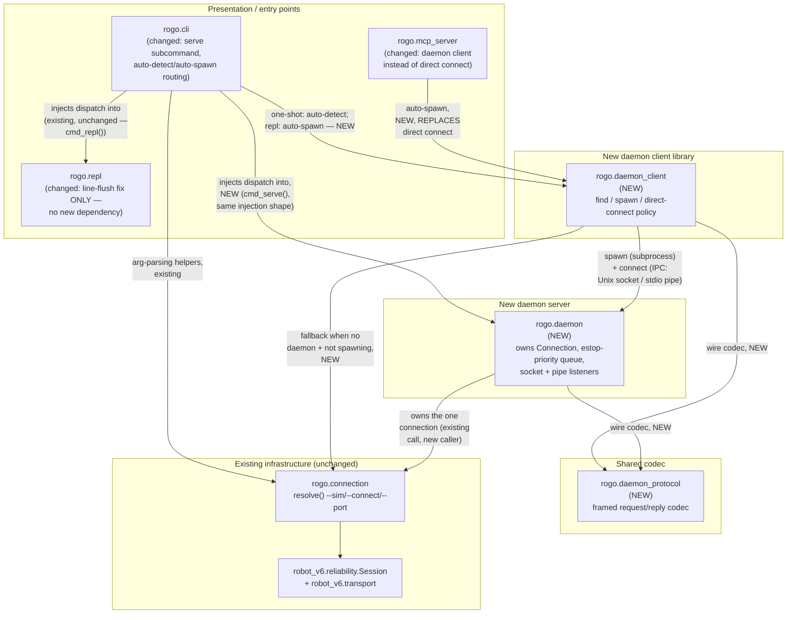

<!-- CLASI: Before changing code or making plans, review the SE process in CLAUDE.md -->

# Sprint 003: Rogo serve daemon and telemetry frame spec restoration

## Goals

Two independent streams, bundled into one sprint because each is small
enough on its own not to warrant a dedicated sprint:

1. Rebuild the `rogo serve` daemon on this repo's v6 host stack, so a
   robot's serial/sim/TCP connection can be held open by one process and
   shared across `rogo` CLI invocations, `rogo repl`, and `rogo mcp`
   without each one grabbing and dropping the port (which resets the MCU
   via DTR/HUPCL and wipes live-pushed config on macOS).
2. Restore the dropped §6 Telemetry chapter to `docs/design/protocol.md`
   and close the real protocol hole it left behind — the host has no way
   to ask for a fresh `thdr` if it loses one mid-stream — by adding a
   host-requested header re-emission command in `src/protocol/`.

## Problem

**Daemon (issue: `rebuild-rogo-serve-daemon-on-v6-named-sockets-pipe-mode-sim.md`).**
`radio-robot-elite` had a `rogo serve` daemon for exactly this reason; it
was deliberately excluded from sprint 001's v5→v6 CLI import because it
targeted v5's binary plane. There is currently no v6-stack equivalent —
every `rogo` invocation and every `rogo mcp` session owns the connection
itself, so switching between tools means dropping and reopening the port,
which resets the robot and loses any config pushed live in the current
session.

**Telemetry spec (issue:
`restore-the-telemetry-frame-specification-and-add-a-host-requested-header-command.md`).**
Commit `34d12c2` folded the old `docs/protocol-v6-spec.md` into
`docs/design/protocol.md` but dropped its entire §6 Telemetry chapter.
`protocol.md` now references `thdr`/`t` frames, six `TLM` modes, and a
"telemetry cadence" throughout without ever defining the frame grammar,
mode semantics, or column layout — and three code comments cite `§6.x`
sections that no longer exist. Separately, the implementation has never
had a way to recover a lost header: the old spec claimed `TLM NOW`
re-requests it, but the code only re-emits `thdr` on a column-set change,
so a host that misses the header (dropped frame, mid-stream reconnect)
has no way to ask for one.

## Solution

**Daemon.** Rebuild `rogo serve` using the v5 daemon's design as spec,
not its code: one held connection (serial/`--sim`/TCP) for the daemon's
lifetime, a framed request/reply wire protocol with echoed correlation
ids, an estop-priority queue so any client's halt jumps ahead of another
client's in-flight command, two transports (named per-robot Unix socket
for production, stdio pipes for tests/embedding) speaking the identical
protocol, and `rogo mcp` plus one-shot/`repl` CLI invocations becoming
daemon clients instead of connection owners. A small, independently
landable fix — forcing line-buffered/flushed output on `rogo repl` and
daemon pipe mode — rides along since it touches the same code paths and
was called out as able to land ahead of the daemon work.

**Telemetry spec.** Restore a telemetry-frame section to
`docs/design/protocol.md`, written against this library's actual
projection (not a verbatim copy of the full-robot POSE/FULL tables),
covering `TLM <mode>` subscription semantics, the `thdr`/`t` grammar and
emission rules, this library's column sets, and a pointer to the
recoverable full-robot tables. Add a `TLM HDR`-style host-requested
header re-emission command to `src/protocol/` — likely a small addition
(a mode token that clears remembered-header state so the existing
`headerChanged()` re-emission path fires) — with a test proving the
header re-emits without changing the current subscription mode. Fix the
three dangling `§6.x` code citations to point at the restored section
numbering.

## Success Criteria

- `rogo serve` holds one connection open across multiple client sessions
  without resetting the robot between them; verified against both a
  named Unix socket and stdio pipe mode, and against `tools/sim`.
- An estop/halt from any daemon client preempts another client's
  in-progress command.
- `rogo mcp` and `rogo` CLI/`repl` invocations can route through a
  running daemon.
- `rogo repl` and daemon pipe-mode output are always line-flushed with
  no `PYTHONUNBUFFERED=1` workaround needed.
- `docs/design/protocol.md` has a telemetry-frame section covering mode
  semantics, frame grammar, and this library's column sets, without
  repeating the incorrect "`TLM NOW` recovers the header" claim.
- All three dangling `§6.x` code citations resolve to real sections.
- A host-requested header re-emission command is implemented and tested:
  lose/forget the header, request it, confirm `thdr` re-emits before the
  next `t` and the subscription mode is unchanged.

## Scope

### In Scope

- `rogo serve` daemon: connection ownership, framed wire protocol,
  estop-priority queue, Unix-socket and stdio-pipe transports, sim
  support.
- `rogo mcp` and CLI/`repl` becoming daemon clients (with a documented
  fallback when no daemon is running).
- Unbuffered/line-flushed output fix for `rogo repl` and pipe mode.
- Restored §6 Telemetry chapter in `docs/design/protocol.md`, scoped to
  this library's actual column projection.
- `TLM HDR`-style host-requested header re-emission command in
  `src/protocol/`, with a test.
- Fixing the three dangling `§6.x` code citations.

### Out of Scope

- Camera-based `--auto` calibration mode (deferred per overview.md, not
  part of this sprint).
- `go_to_w`'s world-frame pose source (deferred per overview.md).
- The wifi-link dual-plane transport implementation against this
  repo's own transport (specified elsewhere, not started here).
- Full-robot POSE/FULL telemetry columns beyond DiffDrive's projection —
  the restored spec points at them but does not implement ports for them.
- Any change to the five non-`WHEELS_V` motion verbs' planner behavior.

## Test Strategy

**Daemon stream** — no hardware required anywhere in this sprint's own
test suite; every daemon test runs against `tools/sim` or a mocked
target, mirroring UC-011's existing no-hardware guarantee:

- **Server core & wire protocol** (`daemon.py`, `daemon_protocol.py`):
  unit tests against `daemon_protocol`'s encode/decode round-trip
  (framing, correlation-id echoing), and a forked-subprocess test that
  drives `rogo serve --sim` in stdio pipe mode end to end (write a
  framed request, read a framed reply) — the same mechanism production
  Unix-socket mode uses, per SUC-003.
- **Estop priority**: a test harness issues a long-running motion
  request from one simulated client, then an estop from a second, and
  asserts the estop's reply arrives and takes effect first (SUC-004).
- **Transports & naming** (Unix socket + stdio pipe, robot-name → socket
  path resolution): a test confirms two differently-named targets
  produce two distinct, discoverable socket paths, and that the
  well-known directory falls back correctly when `XDG_RUNTIME_DIR` is
  unset.
- **Client library & routing** (`daemon_client.py`, plus `cli.py`'s
  auto-detect/auto-spawn call sites): a test confirms a one-shot command
  falls back to direct-connect unchanged when no daemon is running
  (regression guard against SUC-001's second acceptance criterion), and
  that `rogo mcp`/`rogo repl` auto-spawn one when absent.
- **End-to-end**: two sequential one-shot `rogo` invocations against one
  daemon, verified to not reset `tools/sim`'s connection state between
  them (SUC-001's first acceptance criterion) — the closest this suite
  gets to the actual stakeholder complaint.
- **Unbuffered output**: a test asserts `rogo repl` and daemon pipe-mode
  output is flushed line-by-line with stdout redirected to a pipe (not a
  tty), with no `PYTHONUNBUFFERED=1` set.
- Scoped per ticket, `uv run python -m pytest -q` restricted to the
  module(s) that ticket touches (`tests/host/rogo/`,
  `tests/host/robot_v6/` only if a shared fixture changes); the full
  suite runs once, at `close_sprint`, per this project's own testing
  rule.

**Telemetry stream** — C++ tests through the existing
`tests/protocol/` harness (golden vectors + adversarial fixture
convention already established for `src/protocol/`):

- A new golden-vector-style test: subscribe (`TLM POSE` or similar),
  consume/forget the header, send `TLM HDR #id`, and assert `thdr`
  re-emits before the next `t` frame and the subscription mode is
  unchanged (SUC-005's own acceptance criteria, and the issue's own
  Verification section).
- A characterization check that no other `src/protocol/` wire behavior
  changed — the existing adversarial/golden-vector suites should pass
  unmodified except for the one new vector above.
- Documentation is verified by review, not a test: the restored §10
  covers all four spec points the issue's Proposed Fix names (mode
  table, `thdr`/`t` grammar, this library's column sets, and the
  full-robot-table pointer), and the three dangling `§6.x` citations are
  grepped for and confirmed gone.

## Architecture

**Sizing: Substantial.** The daemon stream introduces a new subsystem —
three new modules (`daemon.py`, `daemon_client.py`, `daemon_protocol.py`
under `src/host/rogo/`) — and new cross-module dependencies: `cli.py`,
`repl.py`, and `mcp_server.py` each gain a dependency on the new daemon
client, and `mcp_server.py`'s dependency structure changes shape (it
stops owning a connection directly and instead resolves one through the
daemon client). That is 6+ touched/new modules and a genuine
dependency-direction change, clearing the substantial bar well past the
compact tier's "one module, no new cross-module dependency" test. The
telemetry stream (doc restoration + `TLM HDR`) is individually compact —
one new enumerator and one new dispatch branch, confined to
`src/protocol/`, no cross-module dependency change — but it rides along
in this sprint rather than getting its own tier, since the sprint as a
whole is sized by its most complex stream, per the effort-decision
guidance ("prefer the heavier tier"). The full 7-step methodology
applies, including the required component/dependency diagram for the
daemon subsystem.

### Step 1: Understand the problem

Two independent problems, detailed in Goals/Problem/Solution above:
(1) every `rogo` entry point (`cli.py`'s one-shot commands, `repl.py`,
`mcp_server.py`) currently owns its connection directly via
`rogo.connection.resolve()`, so switching tools means closing and
reopening the serial port, which resets the robot (DTR/HUPCL) and wipes
live-pushed config; (2) `docs/design/protocol.md` lost its entire §6
Telemetry chapter in a 2026-08-21 consolidation commit, and the
implementation has never had a way to recover a lost `thdr` header once
subscribed — `TLM NOW` was claimed to do this but never did.

### Step 2: Identify responsibilities

**Daemon stream** — four distinct, independently-changing
responsibilities:
- Owning the one long-lived robot connection and serializing access to
  it across clients, with an estop-priority queue (a genuinely new
  responsibility, not currently held by anything).
- Speaking a framed request/reply wire protocol with correlation ids,
  shared identically by both ends (a codec responsibility, same
  category as `robot_v6.codec` already is for the robot-facing wire).
- Presenting a connection-shaped client interface that lets existing
  per-verb dispatch code stay unaware of whether it is talking to a
  direct connection or a daemon-proxied one, plus the policy for
  finding/spawning a daemon by robot name (a client-library
  responsibility distinct from the server itself).
- Routing existing entry points (`cli.py` one-shot commands, `repl.py`,
  `mcp_server.py`) through that client library instead of
  `rogo.connection.resolve()` directly (an integration responsibility
  in each of those three modules, not a new module of its own).

**Telemetry stream** — two responsibilities, already-separable:
- Documentation: specifying the frame grammar, mode semantics, and this
  library's column sets (a `docs/design/protocol.md` concern only).
- Implementation: the `TLM HDR` header-recovery token (a
  `src/protocol/` concern only, and a narrow one — see Step 3).

These two streams share no code and no module, which is exactly why they
can execute as independent ticket chains within one sprint.

### Step 3: Define subsystems and modules

**`rogo.daemon`** (new file, `src/host/rogo/daemon.py`) — purpose:
route each client's request, over the framed protocol, to the one robot
connection it holds open for the process's lifetime, escalating any
estop request ahead of whatever else is queued. Boundary: owns the
single `rogo.connection.Connection` for its lifetime; owns the
estop-priority work queue; owns the two listener transports (Unix
socket, stdio pipe). It does NOT own per-verb command semantics and
does NOT import `cli.py` — it receives `cli.py`'s per-verb dispatch
bodies **by injection**, called once per request, exactly the way
`repl.py` already receives them today (`repl.py`'s own docstring: "this
module never imports `rogo.cli`"; `cli.py`'s `cmd_repl()` is the one
that imports `repl.py` and hands its own dispatch functions in). This
is not a stylistic preference — it is what keeps the new `cli.py` →
`daemon.py` edge (added below, for wiring the `serve` subcommand) from
becoming a cycle: if `daemon.py` also imported `cli.py` for dispatch,
the two modules would depend on each other. Serves SUC-001, SUC-002,
SUC-003, SUC-004.

**`rogo.daemon_client`** (new file, `src/host/rogo/daemon_client.py`) —
purpose: resolve a robot name into a live connection, whether that means
finding a running daemon, spawning one, or falling back to a direct
connection. Boundary: the only module that knows the
find-vs-spawn-vs-direct-connect policy (Design Rationale below); returns
an object presenting the same call surface `rogo.connection.resolve()`
already returns, so `cli.py`/`repl.py`/`mcp_server.py`'s existing
dispatch code needs no changes beyond how it obtains its connection.
Does not itself implement the wire framing (delegates to
`daemon_protocol`) or the estop-priority queue (that is server-side
only, invisible to a client). Serves SUC-001, SUC-002.

**`rogo.daemon_protocol`** (new file, `src/host/rogo/daemon_protocol.py`)
— purpose: encode and decode the framed request/reply wire protocol
(one request line in, one JSON reply line out, correlation ids echoed)
shared by `daemon.py` and `daemon_client.py`. Boundary: pure codec, no
socket/pipe I/O of its own (mirrors how `robot_v6.codec` is a pure codec
separate from `robot_v6.transport`) — so the daemon's own two ends can
never independently drift on the wire shape. Serves SUC-001 through
SUC-004 indirectly (every daemon exchange goes through it).

**`rogo.cli`** (existing, changed) — gains three things, all additive to
its existing router role: (1) a `serve` subcommand — `cmd_serve()`
imports `daemon.py` and calls it, injecting `cli.py`'s own per-verb
dispatch functions the same way `cmd_repl()` already injects them into
`repl.py`; (2) auto-detect routing for one-shot subcommands (`drive`/
`turn`/`goto`/`config`/`calibrate`) — each `cmd_*()`'s existing
`connection.resolve()` call is replaced with a call to
`daemon_client`'s auto-detect-only resolver, which falls back to
`connection.resolve()` unchanged when no daemon is found; (3)
`cmd_repl()` resolves its connection through `daemon_client`'s
auto-spawn resolver before injecting it into `repl.py`, so `repl.py`
itself needs no new dependency at all (Design Rationale below). Its
existing per-verb dispatch bodies are unchanged in shape — they now
just may be called by `daemon.py` too, and may be handed a
daemon-proxied connection instead of a direct one, transparently.
Serves SUC-001.

**`rogo.repl`** (existing, changed) — gains only the standalone
unbuffered/line-flushed output fix. It does **not** gain a new
dependency on `daemon_client`: `cli.py`'s `cmd_repl()` already resolves
`repl.py`'s connection today (direct, via `connection.resolve()`) and
injects it; this sprint changes what `cmd_repl()` resolves *through*
(`daemon_client` instead of `connection` directly), not who resolves
it — so `repl.py`'s own module boundary (already the narrowest in this
package: "owns only the command loop") stays exactly as narrow as its
own docstring already declares. Serves SUC-001.

**`rogo.mcp_server`** (existing, changed) — stops owning
`rogo.connection` directly; resolves its connection through
`daemon_client` instead (auto-spawn-if-absent — unlike `cli.py`'s
one-shot commands, `mcp_server` has no `cli.py`-style injection point to
receive an already-resolved connection through, so it calls
`daemon_client` itself, directly). This also resolves a standing
tension in the module's own docstring: it previously avoided importing
`cli.py` because `cli.py`'s dispatch is shaped for a terminal (print +
exit code), not structured MCP data: once the daemon returns structured
JSON, `mcp_server` no longer needs to reason about `cli.py`'s output
shape at all — it gets structured data either way, which is *why* the
daemon can genuinely simplify this module rather than just relocate its
complexity. Serves SUC-002.

**`docs/design/protocol.md`** (existing, changed) — gains a new §10
Telemetry chapter (Design Rationale below explains the numbering
choice). No module/code boundary — a documentation-only change.

**`src/protocol/adapter.h` + `src/protocol/protocol_handler.cpp`**
(existing, changed) — purpose of the change: recognize a new `HDR`
`TLM` mode token that clears the handler's own remembered-header state
(`everEmittedHeader_`) so `headerChanged()` fires on the next
`emitTelemetry()`, without changing the adapter's persisted subscription
mode. Boundary: contained entirely within `ProtocolHandler` — `execTlm()`
intercepts `HDR` before it would reach `Adapter::onTlm()`, so
`src/adapter/diffdrive_adapter.cpp` needs no change at all, honoring the
issue's "no other behavior change to `src/protocol/`" constraint by
touching the minimum: one new `TlmMode` enumerator and one new
dispatch branch. Serves SUC-005.

### Step 4: Diagrams

A component/dependency diagram is required (6+ modules touched, new
cross-module dependencies introduced) — combined into one diagram below
since the new dependency edges ARE the interesting relationships between
components here; a second, separate abstract dependency graph would
repeat the same edges with less context and is omitted as redundant (the
sprint-020 precedent for omitting a diagram that adds nothing applies in
spirit to omitting a *duplicate* one, not to omitting this one). No ERD:
nothing in this sprint introduces or changes a persisted data model (the
daemon's socket path is a runtime artifact, not stored data).

**Reading the new edges**: `CLI` → `DC` and `MCP` → `DC` are the new
cross-module dependencies the sizing decision cites. `CLI` → `DAEMON`
is a compile-time import (for wiring the `serve` subcommand and
injecting dispatch), deliberately **one-directional** — `DAEMON` never
imports `CLI` back (it receives dispatch by injection instead, mirroring
the pre-existing `CLI` → `REPL` injection edge shown for context), which
is what keeps this from becoming a cycle: an earlier draft of this
diagram had the dispatch-reuse edge pointing the wrong way
(`DAEMON` → `CLI`), which combined with the necessary `CLI` → `DAEMON`
subcommand-wiring edge would have been circular — caught and fixed in
this section's own self-review (Phase 3). `DC` → `DAEMON` is a
subprocess launch plus process-to-process IPC, not a compile-time
import — `DC` and `DAEMON` only share compile-time code through `DP`,
the codec. `DAEMON` → `CONN` reuses the existing connection-resolution
module in a new role (owned for a process's whole lifetime instead of
one call's) — `DAEMON` reaches `tools/sim` through this same existing
`CONN` `--sim` path, not a new direct edge. No cycle: dependency
direction flows presentation (`CLI`/`MCP`) → client library (`DC`) →
server (`DAEMON`, over IPC) → existing infrastructure (`CONN`/
`SESSION`), consistent with this project's own
Presentation→Domain→Infrastructure convention.

### Step 5: What changed / Why / Impact / Migration

**What Changed**:
- Three new modules under `src/host/rogo/`: `daemon.py`,
  `daemon_client.py`, `daemon_protocol.py`.
- `cli.py`: new `serve` subcommand; one-shot commands gain daemon
  auto-detect routing.
- `repl.py`: daemon auto-spawn routing; unbuffered/line-flushed output.
- `mcp_server.py`: connection resolution moves from direct
  `rogo.connection` ownership to `daemon_client`.
- `docs/design/protocol.md`: new §10 Telemetry chapter; three dangling
  `§6.x` code citations updated to point at §10.
- `src/protocol/adapter.h`: new `TlmMode::kHdr` enumerator.
- `src/protocol/protocol_handler.cpp`: `parseTlmMode()` gains the
  `"HDR"` token; `execTlm()` gains the header-recovery branch.

**Why**: see Problem/Solution above — the daemon change closes the
port-reset failure mode (issue's core complaint); the telemetry change
closes a documentation gap that breaks the stated MicroPython/JavaScript
port workflow, plus a real protocol hole (no way to recover a lost
header).

**Impact on Existing Components**: `rogo.connection` is unchanged in
its own right — it gains a new caller (`daemon.py`) using it exactly as
`cli.py` always has (`resolve()` once, hold the result). `robot_v6`
(transport/reliability/motion/codec) is untouched — the daemon speaks a
NEW, separate framed protocol to its own clients; it still speaks
ordinary protocol-v6 to the robot through the existing `robot_v6` stack
unchanged. `src/adapter/diffdrive_adapter.cpp` is untouched (Step 3).
No existing test's wire expectations change for anything other than the
new `TLM HDR` token and the new daemon modules' own new tests.

**Migration Concerns**: No data migration (no persisted data model
changes). Backward compatibility: a user who never runs `rogo serve`
sees no behavior change at all — `cli.py`'s one-shot commands fall back
to today's direct-connect when no daemon is found, and `repl`/`mcp`'s
auto-spawn is additive, not a requirement to opt into. Deployment
sequencing: the telemetry stream and the daemon stream have no
interdependency and can land in either order; within the daemon stream,
server/protocol/transport work must land before the three
existing-module integrations (Phase 4 ticket ordering below). Open
question (flagged again in Step 7): the auto-spawned daemon's idle
timeout value is not fixed by this architecture — a ticket will need a
default, tunable via flag/env var. Risk: routing through a daemon adds
one IPC hop (client → daemon → robot) versus today's direct connection;
expected negligible at this project's classroom-robotics command rates
(not a real-time control loop), but not measured by this architecture —
a ticket's test plan should confirm it does not visibly affect
interactive `rogo repl` responsiveness.

### Step 6: Design rationale

**Decision: well-known socket directory.** Use `$XDG_RUNTIME_DIR/rogo/`
when `XDG_RUNTIME_DIR` is set (Linux/CI convention), else
`~/.rogo/run/` (works everywhere, including macOS where
`XDG_RUNTIME_DIR` is typically unset — and macOS is this issue's own
stated motivating platform for DTR/HUPCL resets). Socket filename is
the resolved robot name (e.g. `tovez.sock`), matching the issue's own
per-robot-name requirement. Directory created with owner-only
permissions (0700) — a robot-control socket is a local privilege
boundary, not something that should default to world-accessible just
because Unix sockets often are. *Alternatives considered*: a
repo-relative directory (e.g. `config/robots/run/`) — rejected, because
`config/` is version-controlled project state (`config/robots/` holds
committed robot configs) and a live runtime socket is the opposite of
that; a single fixed path with no robot-name discrimination — rejected,
contradicts the issue's explicit "multiple robots on one host = multiple
daemons, each discoverable by robot name" requirement.

**Decision: `rogo mcp`/`rogo repl` auto-spawn; one-shot `rogo <cmd>`
auto-detects only.** Both policies live in `daemon_client`, chosen by
which caller invokes it. `rogo mcp` and `rogo repl` are themselves
long-lived session tools — the natural owner of a daemon's lifecycle is
whatever process is already committing to a long-lived session, so
auto-spawning matches user intent and directly serves this issue's
Requirement 4 ("share a robot without fighting over the port"). A
one-shot `rogo drive ...` invocation is different: it is exactly the
pattern that causes today's reset problem, so it SHOULD route through an
existing daemon when one is already running — but it must not spawn a
new persistent background process on its own, because a fire-and-forget
one-shot command has no natural moment to ever stop that daemon again,
and accumulating orphaned daemons across a classroom's many one-shot
invocations is a worse failure mode than the one being fixed. If no
daemon is found, one-shot commands fall back to today's unchanged
direct-connect-and-close behavior — so a user who never runs `rogo
serve`/`rogo mcp`/`rogo repl` sees zero behavior change. *Alternatives
considered*: uniform auto-spawn everywhere — rejected for the orphaning
reason above; uniform auto-detect-only (never spawn, including for
`mcp`/`repl`) — rejected because it would put the daemon-starting burden
back on the user for exactly the tools (`mcp`, in particular — an
external agent's whole session) this issue exists to make transparent
for; an explicit `--daemon`/`--no-daemon` flag on every command —
rejected as unnecessary ceremony given the auto-detect fallback already
makes the daemon-absent path safe and unsurprising.
Auto-spawned daemons self-terminate after an idle timeout with no
connected clients, so they do not accumulate indefinitely even under the
auto-spawn policy; the exact timeout value is an open question (Step 7).

**Decision: daemon receives `cli.py`'s per-verb dispatch by injection,
the same direction `repl.py` already uses — `daemon.py` never imports
`cli.py`.** `repl.py` already established the pattern: `cli.py`'s
`cmd_repl()` imports `repl.py` and hands its own dispatch functions in
as a parameter, so `repl.py` never needs to import `cli.py` back
(`repl.py`'s own docstring is explicit about this, to avoid a circular
import). `daemon.py` follows the identical shape — `cli.py`'s new
`cmd_serve()` imports `daemon.py` and injects dispatch the same way —
rather than extracting a fourth new module purely to hold shared
dispatch logic. This direction is not just a style match: `cli.py` must
already import `daemon.py` to wire the `serve` subcommand (an ordinary,
unavoidable router-to-implementation edge, same shape as `cli.py`'s
existing import of `mcp_server.py`/`repl.py`/`calibrate.py`), so if
`daemon.py` also imported `cli.py` for dispatch, the two modules would
form a cycle. This was in fact the first draft of this diagram (caught
in this section's own self-review, Phase 3) — the fix is the injection
direction, not a different module boundary. *Alternatives considered*:
extract a `rogo.dispatch` module shared by `cli.py`/`repl.py`/
`daemon.py` — rejected as unnecessary churn to an already-working,
already-reused pattern for this sprint, and it would not by itself have
prevented the cycle risk (the same injection-direction discipline is
still needed regardless of where the dispatch functions live); revisit
extraction only if a fourth independent consumer needs the dispatch
table without depending on `cli.py`'s own presentation concerns.

**Note on `cli.py`'s fan-out.** `cli.py` now imports nine sibling
modules (`agent_manual`, `calibrate`, `config`, `connection`,
`daemon` (new), `daemon_client` (new), `mcp_server`, `repl`,
`turn_model`), above the 4-5 fan-out guideline. This is a deliberate,
justified exception rather than a coupling problem: `cli.py`'s own
cohesion statement is "it routes, it does not implement" (its own
module docstring) — every one of those nine imports is a subcommand
wiring or an argument-parsing helper, not shared business logic, and a
CLI composition root is the recognized shape where broad, shallow
fan-out is inherent to the one job (dispatch to feature modules) rather
than a sign the module is doing too much itself. The cohesion test still
passes: one sentence, no "and" — "wire each subcommand to the module
that implements it."

**Decision: telemetry chapter placement in `protocol.md`.** Append the
restored chapter as a new top-level §10 (after current §9 Gaps) rather
than reusing the old spec's "§6" numbering, which would require
renumbering every section from current §6 onward and every
cross-reference to them throughout an already heavily
cross-referenced document. The issue itself allows either "the restored
numbering or updated comment references" — this chooses the latter: the
three dangling code citations are updated to point at §10.x, and a
forward-pointer is added at existing §5.2 ("see §10 for the full
telemetry-frame specification") so the chapter stays discoverable from
the section that already summarizes it. *Alternatives considered*:
renumber to match the old spec's §6 — rejected, high-risk/high-diff for
a documentation-only ticket with no behavioral payoff; insert as a new
§5.3 sub-section under the existing DiffDrive-adapter chapter —
rejected, telemetry's mode-subscription semantics (`TLM <mode>`) are a
handler/wire-grammar concern that outgrows being a subsection of one
concrete adapter's own chapter.

**Decision: `TLM HDR` wire form.** `TLM HDR #<id>` — reuses the
existing `TLM <mode> #id` slot exactly as the issue suggests, so it is
sequenced like every other `TLM` form with no new grammar rule needed.
*Alternative considered*: a distinct new verb (e.g. `TLMHDR`) — rejected,
would need its own entry in the sequenced-verb table for no expressive
gain over reusing the existing mode-token slot.

### Step 7: Open questions

- Exact idle-timeout duration before an auto-spawned daemon
  self-terminates with no connected clients — needs a default (a ticket
  will propose one; stakeholder can override).
- Robot-name resolution when a robot's hello/identify response is
  unavailable (e.g. `--sim` target) — falls back to a flag-supplied name
  or a fixed default (e.g. `sim`) per the issue's own "overridable by
  flag" language; the exact default for the flag-absent `--sim` case is
  a ticket-level decision, not an architectural one.
- Whether `rogo serve`'s Unix-socket listener needs any access control
  beyond directory permissions (0700) — out of scope for this sprint
  (no new *authentication* layer is introduced, consistent with this
  project's existing no-auth-at-the-wire-layer posture for `rogo mcp`'s
  own `--listen`), flagged here in case the stakeholder wants it
  revisited before wider deployment.

## Use Cases

**Sizing: Substantial** (see Architecture above) — full use-case
treatment for both streams.

### SUC-001: Drive a robot through a shared `rogo serve` daemon without resetting it between commands
Parent: UC-014

- **Actor**: CLI / tooling user
- **Preconditions**: A robot (or `--sim`) target is reachable; a
  `rogo serve` daemon may or may not already be running for it.
- **Main Flow**:
  1. User starts `rogo serve` (explicitly, or it is auto-spawned by a
     `rogo repl` session) against a target, which holds one connection
     open for its lifetime and listens on a named Unix socket (and, for
     tests, stdio pipe mode).
  2. User runs a one-shot `rogo drive ...` (or `rogo turn`/`rogo goto`/
     `rogo config`/`rogo calibrate`); the CLI auto-detects the running
     daemon by robot name and routes the command through it instead of
     opening its own serial connection.
  3. User runs a second one-shot command (or starts `rogo repl`)
     immediately after; it reuses the same daemon connection — the
     serial port is never closed and reopened between the two
     invocations.
- **Postconditions**: Both commands executed against the robot with no
  DTR/HUPCL reset between them; any live-pushed config from the first
  command is still in effect for the second.
- **Acceptance Criteria**:
  - [ ] Two sequential one-shot `rogo` invocations against the same
        daemon do not reset the robot (verified against `tools/sim`
        and against the daemon's stdio pipe mode in a test harness).
  - [ ] With no daemon running, a one-shot command's behavior is
        unchanged from today (direct connect, no auto-spawn).
  - [ ] `rogo repl` output (and daemon pipe-mode output) is always
        line-flushed with no `PYTHONUNBUFFERED=1` workaround needed.

### SUC-002: Expose robot control via MCP through a daemon-owned connection
Parent: UC-016

- **Actor**: CLI / tooling user (or an external MCP client/agent)
- **Preconditions**: `rogo mcp` is invoked; a daemon for the target
  robot may or may not already be running.
- **Main Flow**:
  1. `rogo mcp` starts and resolves its connection through
     `daemon_client` instead of calling `rogo.connection.resolve()`
     directly.
  2. If no daemon is running for the resolved target, `daemon_client`
     auto-spawns one and connects to it.
  3. An external MCP client calls a tool (e.g. `drive`); the server
     translates it into a daemon request the same way it previously
     translated it into a direct `robot_v6.motion` call.
  4. A second tool (e.g. `rogo drive` run concurrently from another
     terminal, or another MCP session) can reach the same robot through
     the same daemon without contention over the serial port.
- **Postconditions**: The MCP session and any other daemon client can
  coexist against one robot connection.
- **Acceptance Criteria**:
  - [ ] `rogo mcp` no longer opens its own direct serial/sim/TCP
        connection when a daemon is available or can be spawned.
  - [ ] A `kUnknown`/merits-rejection outcome is still reported as a
        `warning`/`error` key in the tool's own result (unchanged from
        today), now sourced from the daemon's structured reply instead
        of a direct wire read.
  - [ ] A genuine unreachable-target failure still surfaces as
        `UnreachableTargetError` through the MCP tool-call error
        channel (unchanged from today).

### SUC-003: Develop and test the daemon's wire protocol with no hardware attached
Parent: UC-011

- **Actor**: Developer running the sim server
- **Preconditions**: `tools/sim` is built.
- **Main Flow**:
  1. Developer starts `rogo serve --sim`, which boots (or attaches to)
     `tools/sim` the way the CLI's own `--sim` resolution already does,
     then holds that connection open.
  2. A test forks the daemon in stdio pipe mode, writes framed requests
     to its stdin, and reads framed JSON replies from its stdout —
     exercising the exact wire protocol production uses (Unix socket
     mode uses the identical framing, different transport).
  3. Test drives estop-priority behavior: issues a long-running motion
     request, then an estop request from a second simulated client, and
     confirms the estop's reply arrives and takes effect ahead of the
     first request's completion.
- **Postconditions**: Daemon behavior (framing, dispatch, estop
  priority) is validated end to end with no physical robot, the same
  no-hardware guarantee UC-011 already provides for the rest of the
  host stack.
- **Acceptance Criteria**:
  - [ ] A test forks the daemon in pipe mode and exchanges at least one
        full request/reply cycle over stdio.
  - [ ] `rogo serve --sim` reaches a working daemon with no manually
        started `tools/sim` process required.

### SUC-004: Preempt any client's in-flight command with another client's estop
Parent: UC-005

- **Actor**: CLI / tooling user (any daemon client)
- **Preconditions**: A daemon is running with at least one client
  connected and a long-running motion command in flight from that
  client.
- **Main Flow**:
  1. A second client connects to the same daemon and sends an
     estop/halt request.
  2. The daemon's estop-priority queue jumps that request ahead of the
     first client's in-progress completion wait and executes it
     immediately against the single owned connection.
  3. Both clients observe the estop's effect; the first client's
     original command is not silently dropped — it completes/aborts
     per the estop's own semantics.
- **Postconditions**: The robot is stopped regardless of which client
  requested it or what any other client was doing at the time.
- **Acceptance Criteria**:
  - [ ] An estop from one daemon client preempts another client's
        in-progress long-running command in a test harness (stdio pipe
        mode, against `tools/sim`).
  - [ ] No daemon client's halt request can be delayed behind another
        client's queued motion command.

### SUC-005: Recover a lost telemetry header on request
Parent: UC-006

- **Actor**: Host session
- **Preconditions**: A session has subscribed to telemetry (`TLM` in a
  mode other than `OFF`) and has lost or never received the current
  `thdr` header (e.g. a dropped frame, or a mid-stream reconnect).
- **Main Flow**:
  1. Host detects it cannot interpret an incoming `t` frame (no
     remembered header, or a field count mismatch against the header it
     has).
  2. Host sends `TLM HDR #<id>`.
  3. Robot's `ProtocolHandler` clears its remembered-header state
     without changing the adapter's current subscription mode.
  4. The next `emitTelemetry()` call re-emits `thdr` before its next
     `t` frame.
- **Postconditions**: Host has a fresh, correct header; the telemetry
  subscription mode is unchanged from before the request.
- **Acceptance Criteria**:
  - [ ] `docs/design/protocol.md` has a §10 Telemetry chapter covering
        `TLM <mode>` subscription semantics, the `thdr`/`t` grammar and
        emission rules, this library's column sets, and the `TLM HDR`
        command — without repeating the old, incorrect "`TLM NOW`
        recovers the header" claim.
  - [ ] All three dangling `§6.x` code citations
        (`src/protocol/adapter.h:134`,
        `src/protocol/protocol_handler.cpp:1057`,
        `src/archive/protocol-v6/wire_v6_telemetry.h:11`) resolve to
        real sections.
  - [ ] A test loses/forgets the header, sends `TLM HDR`, and verifies
        `thdr` re-emits before the next `t` frame and the subscription
        mode is unchanged.
  - [ ] No other behavior change to `src/protocol/`
        (`src/adapter/diffdrive_adapter.cpp` is untouched).

## GitHub Issues

(GitHub issues linked to this sprint's tickets. Format: `owner/repo#N`.)

## Definition of Ready

Before tickets can be created, all of the following must be true:

- [x] Sprint planning document is complete (sprint.md, including its
      Architecture and Use Cases sections)
- [x] Architecture review passed (or skipped, for changes with no
      architectural impact)
- [ ] Stakeholder has approved the sprint plan

## Tickets

| # | Title | Depends On |
|---|-------|------------|
| 001 | Fix unbuffered/line-flushed output for rogo repl and daemon pipe mode | — |
| 002 | Restore the Telemetry chapter to docs/design/protocol.md | — |
| 003 | Implement TLM HDR header re-emission command and fix dangling section citations | 002 |
| 004 | Build the daemon's shared framed wire-protocol codec | — |
| 005 | Build the rogo serve daemon server core: connection ownership, dispatch injection, estop-priority queue | 004 |
| 006 | Add Unix-socket and stdio-pipe daemon transports with robot-name socket resolution | 005 |
| 007 | Add rogo serve --sim support and stdio-pipe fork test harness | 006 |
| 008 | Build the daemon client library: find / spawn / direct-connect policy | 004, 006 |
| 009 | Route rogo CLI through the daemon: serve subcommand, one-shot auto-detect, repl auto-spawn | 005, 008 |
| 010 | Make rogo mcp a daemon client | 008 |
| 011 | Daemon end-to-end test pass and documentation updates | 007, 009, 010 |

Tickets execute serially in the order listed. Two independent chains
share this order: 001-003 (telemetry stream plus the standalone
output-flush fix) land first since they have no dependency on the
daemon stream; 004-011 (daemon stream) then proceed foundation-first
(codec → server core → transports → sim support/client library →
existing-module integration → end-to-end pass), matching sprint.md's
Architecture Migration Concerns note that the two streams have no
interdependency and can land in either relative order.
