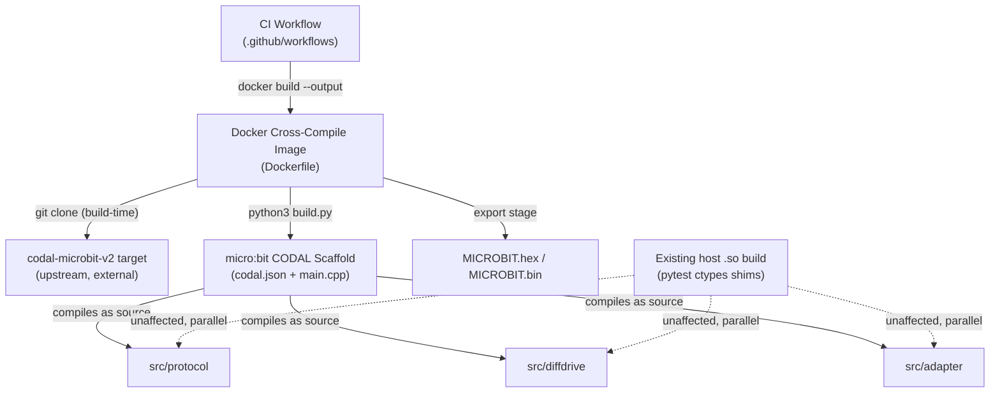

<!-- CLASI: Before changing code or making plans, review the SE process in CLAUDE.md -->

# Sprint 005: Port Docker micro:bit C++ Cross-Compiler from Elite

## Goals

Give this repo a containerized ARM cross-compile check for its C++ sources,
ported from the `radio-robot-elite` repo's Docker-based micro:bit toolchain,
so that `src/protocol`, `src/diffdrive`, and `src/adapter` can be built for
the micro:bit target without any stakeholder installing the ARM toolchain
locally, and so target-only incompatibilities (allocation, exceptions,
headers) that the host-compiled `.so`/pytest path can't see are caught in
CI.

## Problem

This repo is host-only today: `src/protocol`, `src/diffdrive`, and
`src/adapter` are compiled by the native host compiler into `.so` shims
loaded via ctypes for the pytest suites, and `tools/sim` is a host binary.
There is no Dockerfile, no CODAL scaffold (`codal.json`, `build.py`, app
`main.cpp`), and no ARM cross-compile check — so a change that compiles
fine on the host but would fail (or misbehave) when actually cross-compiled
for micro:bit goes undetected until a downstream deployment repo (the
MicroPython image or the MakeCode/PXT package) tries to build against it.
`radio-robot-elite` already has a working Docker-based micro:bit C++
cross-compiler (Dockerfile + CODAL build + CI workflow) built for a
different codebase; that capability needs to be ported and adapted to this
repo's source layout rather than re-invented.

## Solution

Port the Elite repo's `Dockerfile` (microbit-v2-samples/CODAL lineage:
Ubuntu 18.04 builder installing `gcc-arm-embedded` via the
`team-gcc-arm-embedded` PPA, `python3 build.py` CODAL build, `FROM scratch`
export stage for `MICROBIT.bin`/`MICROBIT.hex`) into this repo, adapted so
the CODAL build compiles this repo's `src/protocol`, `src/diffdrive`, and
`src/adapter` sources instead of Elite's application code. This likely
means adding a minimal CODAL app scaffold (`codal.json`, a thin `main.cpp`
entry point) that pulls in this repo's C++ as a library/source target
rather than porting Elite's own application logic. Port
`.github/workflows/docker-image.yml` (or an equivalent) so the
cross-compile runs in this repo's CI, if that fits this repo's existing CI
setup. Document how to invoke the container locally (`docker build`
command and expected output).

## Success Criteria

- A Dockerfile exists in this repo that cross-compiles `src/protocol`,
  `src/diffdrive`, and `src/adapter` for the micro:bit (CODAL) target and
  produces a `.hex`/`.bin` output, runnable locally via a documented
  `docker build` invocation.
- The existing host-compiled `.so`/ctypes pytest path is unaffected — the
  Docker cross-compile is an additional check, not a replacement.
- CI is wired to run the cross-compile (or the sprint explicitly records
  why CI wiring is deferred/out of scope, if it doesn't fit this repo's CI
  setup).
- Documentation (README or equivalent) explains how to invoke the
  container and what it verifies.

## Scope

### In Scope

- Dockerfile ported from `radio-robot-elite`, adapted to compile this
  repo's `src/protocol`, `src/diffdrive`, `src/adapter` sources for the
  micro:bit target.
- Minimal CODAL scaffold (`codal.json`, minimal `main.cpp`/entry point)
  needed to make this repo's sources buildable under CODAL — only as much
  as required to drive the cross-compile, not a full application port.
- CI workflow wiring equivalent to Elite's `docker-image.yml`, if
  appropriate for this repo's CI setup.
- Documentation of local invocation and what the check verifies.

### Out of Scope

- Any change to the existing host-native `.so`/ctypes build path used by
  the pytest suites.
- Porting Elite's own application/robot logic — only the compiler
  container and minimal scaffold needed to build this repo's existing
  sources.
- Flashing, deploying, or running the compiled `.hex` on physical
  micro:bit hardware.
- Changes to the downstream MicroPython image or MakeCode/PXT package
  repos.

## Test Strategy

Verification is the cross-compile itself succeeding: `docker build` (per
Elite's `DOCKER_BUILDKIT=1` invocation) must complete and emit
`MICROBIT.hex`/`MICROBIT.bin` from this repo's `src/protocol`,
`src/diffdrive`, and `src/adapter` sources. If CI wiring is in scope, a CI
run on a PR is the integration-level check. No changes to the existing
pytest suites are expected; they continue to cover the host-native build
path unchanged.

## Architecture

**Sizing: Substantial.** This sprint introduces three new modules with no
prior counterpart in this repo (a Docker cross-compile image, a CODAL
build scaffold, a CI workflow), a new cross-module dependency (the CODAL
scaffold depends on `src/protocol`, `src/diffdrive`, `src/adapter` as
compiled source input — a dependency edge that does not exist today), and
a new external integration (Docker, the ARM GNU toolchain, and the
upstream `codal-microbit-v2`/CODAL build system). Any one of these
triggers the substantial tier on its own; together they clearly do. The
full 7-step methodology applies, including a component diagram.

### What Changed

Three new modules, none of which modify the three existing library
modules' own code — they consume `src/protocol`, `src/diffdrive`, and
`src/adapter` as compiled source input, unchanged:

1. **Docker Cross-Compile Image** (`Dockerfile`, repo root) — packages a
   containerized toolchain (Ubuntu base + `gcc-arm-embedded` + the CODAL
   build's own dependencies: `git make cmake python3`) that compiles the
   micro:bit CODAL Scaffold into flashable binary artifacts, ported from
   `radio-robot-elite`'s `Dockerfile` (Ubuntu 18.04 builder →
   `python3 build.py` → `FROM scratch` export stage copying out
   `MICROBIT.bin`/`MICROBIT.hex`).
2. **micro:bit CODAL Scaffold** (new directory, e.g. `firmware/microbit/`
   — exact path is a ticket-level decision, not fixed here) — a
   `codal.json` targeting `codal-microbit-v2` plus a thin `main.cpp` entry
   point that references `DifferentialDrive`, `ProtocolHandler`, and
   `DiffDriveAdapter` so the linker cannot dead-strip them, proving the
   three modules actually compile and link for the target rather than
   just exercising an empty CODAL app. The Dockerfile's build context
   copies `src/protocol`, `src/diffdrive`, `src/adapter` into this
   scaffold's application source tree so CODAL's own directory-glob
   picks them up with no custom CMake (see Design Rationale, Decision 3).
   `src/archive/` is explicitly excluded — it is read-only provenance
   that nothing in this repo compiles, and the scaffold must not change
   that.
3. **CI Workflow** (new `.github/workflows/` file — this repo has none
   today) — continuously verifies the micro:bit cross-compile stays green
   on every push and pull request, ported from Elite's
   `docker-image.yml` (checkout, `docker build --output`, upload the
   `.hex` artifact).

Plus: documentation of local invocation (a `docker build` command and its
expected output), added to the README or a scaffold-local README —
covered by ticket acceptance criteria, not modeled as a fourth module
since it has no runtime behavior of its own.

### Why

This repo is explicitly host-only today (`README.md`, `docs/design/
overview.md`): `src/protocol`, `src/diffdrive`, `src/adapter` are
compiled by the native host compiler into `.so` shims for the pytest
suites, and the whole repo deliberately has **no build system at all** —
tests compile ad hoc shims with a direct `/usr/bin/c++` invocation
(`tests/adapter/test_diffdrive_adapter.py`'s `_compile_shared_lib`,
`tools/sim/README.md`'s own documented compile line). That proves the
three modules compile for the host's own architecture and ABI; it proves
nothing about the micro:bit's ARM Cortex-M4 target, a different compiler
(`arm-none-eabi-g++`), a different C library (newlib-nano, not glibc), and
CODAL's own build macros. A change that compiles cleanly on the host but
would fail — or silently misbehave — under cross-compilation goes
undetected today until a downstream deployment repo (the MicroPython
image or the MakeCode/PXT package) tries to build against it, which is
too late to be useful feedback. `radio-robot-elite` already solved this
exact problem for its own, much larger firmware tree; porting its proven
Docker/CODAL shape is lower-risk than designing a cross-compile pipeline
from scratch.

### Impact on Existing Components

**None of `src/protocol`, `src/diffdrive`, `src/adapter`'s own code
changes.** They are read as build input, not modified. A quick
portability check during planning found no red flags for a CODAL/embedded
target: `diffdrive.md` §1 documents the kernel's dependency list as
`<cmath> <cstdint> <algorithm>` only; `protocol_handler.h` documents its
own no-dynamic-allocation/no-`std::string`/no-exception discipline
(fixed `char[240]` buffer, `strtol`/`strtof` tokenizing); a grep of all
three modules for `throw`, `std::string`, `std::vector`, `new`, `malloc`,
`std::function` found none. The one thing all three modules do use is
`<cstdio>` (`snprintf`), which CODAL's newlib-nano supports. This means
the *code* is already written to firmware constraints — the actual risk
in this sprint is entirely in the *toolchain/environment* layer (Design
Rationale, Decision 2), not in the library code being cross-compiled.

The existing host-native `.so`/ctypes build path (used by every pytest
suite) is untouched and stays the fast, primary development loop — the
Docker cross-compile is a slower, additive check, run in CI and on demand
locally, not on every `pytest` invocation. The repo root gains a
`Dockerfile` and its first-ever `.github/workflows/` entry; neither
existed before this sprint.

### Architecture Overview

Dependency direction is one-way and newly introduced: the new build/CI
modules depend on the three existing library modules as source input; the
three library modules gain no dependency on Docker, CODAL, or CI, and
have no awareness that this scaffold exists. No cycle is introduced. The
host-native build path (`HOSTBUILD`, dashed) is shown only to make
explicit that it is a separate, parallel consumer of the same three
modules and is not touched by this sprint.

**Module boundaries** (cohesion test — one sentence each, no "and"):

- **Docker Cross-Compile Image**: packages a containerized toolchain that
  compiles the micro:bit CODAL Scaffold into flashable binary artifacts.
  Inside: the `Dockerfile`'s builder stage (toolchain install, `python3
  build.py` invocation) and export stage (`FROM scratch`, copies out
  `MICROBIT.bin`/`.hex`). Outside: what gets compiled (Scaffold's job),
  whether/how CI invokes it (CI Workflow's job).
- **micro:bit CODAL Scaffold**: defines the CODAL application that
  compiles this repo's protocol, diffdrive, and adapter modules for the
  micro:bit target. Inside: `codal.json`, the thin `main.cpp` entry
  point, and the mechanism that places the three modules' sources where
  CODAL's build will see them. Outside: the toolchain that runs the build
  (Docker image's job), the three modules' own logic (untouched, owned
  elsewhere), CI.
- **CI Workflow**: continuously verifies the micro:bit cross-compile
  stays green on every push and pull request. Inside: the workflow YAML
  (checkout, `docker build`, artifact upload). Outside: what's inside the
  image, what's compiled.

Each module traces to at least one use case (SUC-001/SUC-002 below); no
module's fan-out exceeds the three source directories it deliberately
depends on.

### Design Rationale

**Decision 1 — thin scaffold + copy-in, not an application port.**
*Context:* Elite's Dockerfile compiles a full CODAL robot application
(`src/firm`, protobuf codegen, `dotconfig` version bump, host-sim
build); this repo is a library, not an application, and owns no HAL,
no robot config, and no main loop of its own. *Alternatives considered:*
(a) port Elite's actual `main.cpp`/application logic — rejected, it's a
different codebase's robot firmware, not this repo's concern, and would
require HAL ports this repo deliberately does not own; (b) a from-scratch
minimal CODAL "hello world" that doesn't reference this repo's C++ at
all — rejected, it would prove CODAL itself builds but nothing about
*this library's* target-compilability, defeating the sprint's purpose.
*Chosen:* a thin `main.cpp` that constructs/references
`DifferentialDrive`, `ProtocolHandler`, and `DiffDriveAdapter` so the
linker cannot dead-strip them — the minimum needed to prove the actual
library compiles and links for the target. *Consequences:* the scaffold
stays small and has almost no logic of its own to maintain; it will need
a small update if a fourth library module is ever added.

**Decision 2 — toolchain provisioning: PPA first, with a named
fallback.** *Context:* Elite's Dockerfile is `FROM ubuntu:18.04`, which
reached Ubuntu's own end of standard support in April 2023, and installs
`gcc-arm-embedded` from `ppa:team-gcc-arm-embedded/ppa` — a
community PPA with no uptime guarantee. Whether that PPA still resolves
against an 18.04 base as of this sprint's implementation is not
independently verified by this planning pass; discovering a 404 or a
broken `apt-get update` mid-implementation is exactly the kind of
mid-ticket surprise this document exists to prevent. *Alternatives
considered:* (a) port Elite's Dockerfile verbatim and hope the PPA still
resolves; (b) provision the toolchain from ARM's own official release
tarball (`developer.arm.com`'s `arm-gnu-toolchain`, or the pinned xPack
distribution), downloaded and unpacked directly with no PPA and no
distro-version dependency; (c) move to a current Ubuntu base (22.04/24.04)
and install the distro's own `gcc-arm-none-eabi` package. *Chosen:*
attempt (a) first, since it is what Elite has actually proven working and
minimizes deviation from the reference — but ticket 001 must verify the
PPA resolves as a first concrete step, and fall back to (b), a pinned ARM
GNU toolchain release tarball, if it does not; a distro-package
alternative (c) is a viable second fallback but pins to whatever compiler
version that Ubuntu release ships, which is a real if to note. This
fallback path is written down here specifically so it does not have to
be rediscovered mid-ticket. *Consequences:* ticket 001's acceptance
criteria include verifying which path was actually used, so the choice is
recorded, not silently absorbed into a working Dockerfile.

**Decision 3 — bridge the three modules into the scaffold via Dockerfile
`COPY`, not a custom CMake include path.** *Context:* CODAL's build
globs its configured `application` directory for sources; getting
`src/protocol`, `src/diffdrive`, `src/adapter` into that scan without
writing custom CMake. *Alternatives considered:* (a) a custom
`CMakeLists.txt` override adding explicit out-of-tree source lists —
rejected as unnecessary complexity for three small, stable directories;
(b) symlinks — rejected, fragile across Docker's build-context copy
semantics and unnecessary since the Dockerfile already controls exactly
what gets copied where. *Chosen:* the Dockerfile `COPY`s
`src/protocol`, `src/diffdrive`, `src/adapter` into the scaffold's
application source tree at image-build time — the same pattern Elite's
own Dockerfile uses (`COPY . /opt/microbit-samples`), just scoped to
three directories instead of the whole tree. *Consequences:* adding a
fourth compiled module later means one more `COPY` line and one `#include`
in `main.cpp`, not a build-system change.

**Decision 4 — CI wiring is in scope, mirrors Elite's shape closely.**
*Context:* this repo has no CI workflow of any kind today. *Alternatives
considered:* defer CI wiring to a later sprint and ship only the
Dockerfile — rejected per the roadmap's success criteria, which require
either CI wiring or an explicit recorded reason to defer it, and no such
reason surfaced during planning (a workflow this close to Elite's proven
`docker-image.yml` is low effort and directly closes the gap this
sprint exists to close). *Chosen:* port `docker-image.yml` near-verbatim
(checkout → `docker build --output` → upload the `.hex` artifact),
informational-only (no branch-protection gating — see Open Questions).

### Migration Concerns

No data migration — this sprint adds build/CI tooling, no runtime data
or schema. No backward-compatibility break — purely additive; the
existing host-native `.so`/pytest path, `tools/sim`, and every existing
test suite are unmodified. No deployment sequencing — the Docker image
and CI workflow are development/verification tooling, not something that
ships to a robot or a downstream repo. The one real operational risk
carried into implementation is the toolchain-provisioning risk named in
Design Rationale Decision 2 (Ubuntu 18.04 end-of-support, PPA
availability) — flagged there with a concrete, named fallback so it is a
known first step for ticket 001, not a mid-ticket discovery.

### Open Questions

1. **Does `ppa:team-gcc-arm-embedded/ppa` still resolve against an
   Ubuntu 18.04 base?** Not verified during planning (this pass had no
   network access to the container registry/PPA to confirm). Ticket 001
   must check this first and fall back per Design Rationale Decision 2 if
   not.
2. **Exact scaffold directory path/name** (e.g. `firmware/microbit/` vs.
   some other layout) is left to ticket 001 to decide and state in its
   own plan — the architecture fixes the module boundary and the bridging
   mechanism (Decision 3), not the literal path.
3. **Should the new CI workflow gate PRs (branch protection), or run
   informationally only?** Recommended: informational-only for this
   sprint, matching Elite's own `docker-image.yml` (no gating configured
   there either) — branch-protection policy is a stakeholder/ops decision
   outside this sprint's scope, and this is the repo's first-ever CI
   workflow, so adding a hard gate in the same sprint that introduces CI
   at all raises the stakes of a false-positive failure blocking unrelated
   PRs.
4. **Should the scaffold's `codal.json` carry any of Elite's
   `config` overrides** (`MICROBIT_BLE_ENABLED`, `MICROBIT_RADIO_MAX_PACKET_SIZE`,
   etc.)? Recommended: no — this library does not itself touch radio/BLE
   (that is a downstream concern per `docs/design/overview.md`), and the
   scaffold only needs to prove the three modules compile and link, not
   exercise CODAL's radio stack. Default CODAL config is sufficient
   unless implementation discovers otherwise.

## Use Cases

Substantial-tier sprint — full use cases. Neither existing UC in
`docs/design/usecases.md` covers a target cross-compile check (UC-011 is
the closest neighbor in spirit — "develop and test host code with no
hardware attached" — but that is about testing *host* code against a
simulator, not about compiling *this library's* C++ for the actual target
hardware's architecture). Both use cases below are new capability with no
existing parent.

### SUC-001: Verify the library cross-compiles for micro:bit with no hardware attached
Parent: None (new capability)

- **Actor**: Developer changing `src/protocol`, `src/diffdrive`, or
  `src/adapter`
- **Preconditions**: Docker is installed locally; no micro:bit or other
  hardware is required or used.
- **Main Flow**:
  1. Developer runs the documented `docker build` invocation from the
     repo root (`DOCKER_BUILDKIT=1 docker build -t microbit-tools
     --output out .`, or equivalent — exact flags finalized in ticket
     001/003).
  2. The Docker Cross-Compile Image's builder stage provisions the ARM
     toolchain, clones the `codal-microbit-v2` target, and runs the CODAL
     build against the micro:bit CODAL Scaffold, which compiles
     `src/protocol`, `src/diffdrive`, and `src/adapter` as source input.
  3. On success, the export stage copies `MICROBIT.hex`/`MICROBIT.bin`
     into `out/`.
- **Postconditions**: A developer has target-architecture proof (ARM
  Cortex-M4, `arm-none-eabi-g++`, newlib-nano) that the three library
  modules compile and link, independent of and in addition to the
  existing host-native `.so`/pytest verification.
- **Acceptance Criteria**:
  - [ ] `docker build` completes with no errors from a clean checkout.
  - [ ] `out/MICROBIT.hex` and `out/MICROBIT.bin` exist after a
        successful build.
  - [ ] The existing `pytest` suite is unaffected — no test file, shim,
        or build step it depends on is modified by this sprint.
  - [ ] Local invocation is documented (command, expected output,
        where the artifacts land).

### SUC-002: Continuously verify the cross-compile on push and pull request
Parent: None (new capability)

- **Actor**: CI (GitHub Actions), on behalf of any contributor
- **Preconditions**: The Docker Cross-Compile Image and micro:bit CODAL
  Scaffold (SUC-001) exist and build successfully locally.
- **Main Flow**:
  1. A push or pull request lands against the repository.
  2. The CI workflow checks out the repo, runs the same `docker build`
     invocation SUC-001 documents, and uploads the resulting `.hex` as a
     build artifact.
  3. CI reports success or failure on the commit/PR, informationally (see
     Open Questions #3 — not configured as a required/blocking check in
     this sprint).
- **Postconditions**: Every push/PR carries a visible, independent signal
  of whether the library still cross-compiles for the micro:bit target,
  with no developer having to remember to run the check by hand.
- **Acceptance Criteria**:
  - [ ] A `.github/workflows/*.yml` file exists that builds the Docker
        image on `push`/`pull_request` and uploads the `.hex` artifact.
  - [ ] The workflow is reviewed for correctness (job steps, artifact
        path) even if a live GitHub Actions run cannot be observed during
        ticket execution.

## GitHub Issues

(GitHub issues linked to this sprint's tickets. Format: `owner/repo#N`.)

## Definition of Ready

Before tickets can be created, all of the following must be true:

- [ ] Sprint planning document is complete (sprint.md, including its
      Architecture and Use Cases sections)
- [ ] Architecture review passed (or skipped, for changes with no
      architectural impact)
- [ ] Stakeholder has approved the sprint plan

## Tickets

| # | Title | Depends On |
|---|-------|------------|
| 001 | micro:bit CODAL scaffold and Docker cross-compile image | — |
| 002 | CI workflow for micro:bit Docker cross-compile | 001 |
| 003 | Document local micro:bit cross-compile invocation | 001 |

Tickets execute serially in the order listed.
